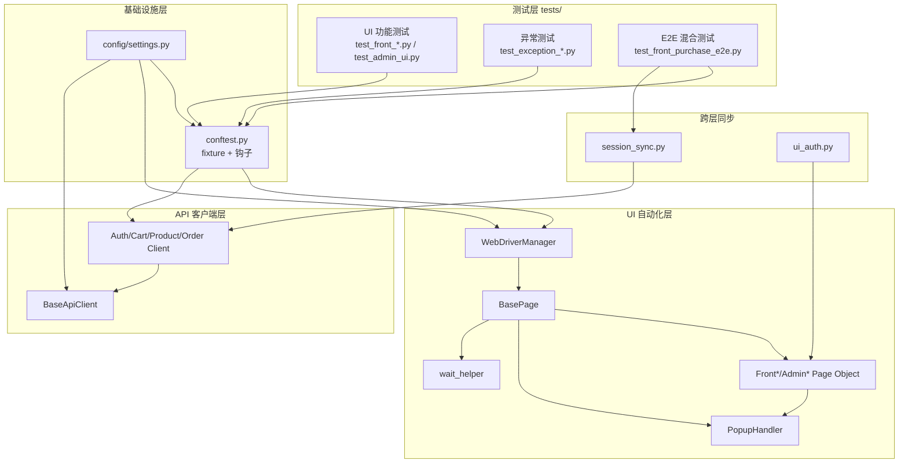

# Tigshop E2E 自动化 — 面试与内推知识手册（interview.md）

> 被测站点：[Tigshop PC 前台](https://demo.tigshop.cn/) · [后台管理](https://demo.tigshop.cn/admin/)  
> 技术栈：**pytest + Selenium 4 + requests + Allure + Nuxt 3 / Element Plus**  
> 测试分层：**UI 功能（15）+ UI/E2E 异常（2）+ E2E 混合流程（2）= 18 条用例**

---

## 文档导航

| 文档 | 定位 |
|------|------|
| [COMMANDS.md](./COMMANDS.md) | 终端命令速查 |
| **interview.md（本文）** | 架构设计、编程技巧、弹窗/网络/Session 方案、面试题 |
| [node.md](./node.md) | 项目知识梳理（若存在） |
| [TESTCASES.md](./TESTCASES.md) | 用例明细（若存在） |

---

## 一、30 秒电梯演讲（内推自我介绍用）

> 我独立搭建了一套面向 **Tigshop 电商演示站** 的端到端自动化测试框架。采用 **pytest + Selenium + requests** 分层设计：UI 层用 **Page Object Model** 验证前台购物流程和后台管理页面；E2E 层实现 **UI 操作 + API 断言** 的混合测试，解决 SPA 页面状态与后端数据不一致的问题。框架内置 **弹窗自动关闭、网络重试、Token 跨层同步、用例级 Session 隔离**，并集成 **Allure 可视化报告** 和失败自动截图。共覆盖 **18 条用例**，包含正常流程和异常场景（无效商品页、无效 Token），可直接用于 CI 回归和面试项目展示。

**关键词（简历/内推可写）：** E2E 自动化 · Page Object · pytest fixture · 混合测试 · JWT 同步 · flaky 治理 · Allure 报告

---

## 二、项目架构总览

```
e2e_function/
├── config/settings.py          # 全局配置中心（URL、账号、超时、重试）
├── api/client/                 # HTTP API 客户端层（E2E 混合断言）
│   ├── base_client.py          # 网络重试 + Tigshop {code,data} 解析
│   ├── auth_client.py          # 登录 / 用户详情
│   ├── product_client.py       # 商品 / SKU
│   ├── cart_client.py          # 购物车
│   └── order_client.py         # 结算 / 订单
├── ui/
│   ├── driver/driver_manager.py  # WebDriver 工厂（Selenium Manager）
│   └── pages/
│       ├── base_page.py          # POM 基类（等待 + 弹窗 + 重试点击）
│       ├── front/                # 前台 7 个 Page Object
│       └── admin/                # 后台 2 个 Page Object
├── utils/
│   ├── wait_helper.py          # stable_delay / retry_action / 页面就绪
│   ├── popup_handler.py        # 弹窗/遮挡层处理器
│   ├── session_sync.py         # localStorage ↔ requests Session
│   ├── ui_auth.py              # UI 登录辅助
│   └── allure_helper.py        # 截图 / JSON 附件
├── tests/
│   ├── conftest.py             # pytest fixture + 钩子
│   ├── ui/                     # UI 功能 + 异常
│   └── e2e/                    # E2E 流程 + 异常
├── generate_allure_report.py   # Allure HTML 报告
└── run_e2e.py                  # 一键跑测入口
```

### 架构分层图



---

## 三、核心编程知识与设计模式

### 3.1 Page Object Model（POM）

**是什么：** 把每个页面封装成一个类，元素定位器和页面操作集中在类方法里，测试用例只调用业务语义方法。

**本项目实践：**

| 层级 | 类 | 职责 |
|------|-----|------|
| 基类 | `BasePage` | `open/find/click/input_text`、URL 等待、弹窗关闭 |
| 子类 | `FrontHomePage` | `search()`、`open_category_list()` |
| 子类 | `FrontProductPage` | `add_to_cart()`、`select_first_sku_if_needed()` |
| 子类 | `FrontCartPage` | `has_cart_content()`、`go_checkout()` |

**好处（面试可说）：**
- 定位器变更只改 Page Object，不用改所有用例
- 测试代码读起来像业务步骤：`home.search(keyword)` → `product.add_to_cart()`
- 基类统一等待和弹窗策略，子类专注 Tigshop 业务

**代码入口：** `ui/pages/base_page.py`、`ui/pages/front/*.py`

---

### 3.2 工厂模式 — WebDriverManager

**是什么：** 把浏览器创建逻辑集中到工厂类，调用方只调 `create_driver()`，不关心 ChromeDriver 路径和版本。

**本项目策略（双重保障）：**

1. **优先** Selenium 4 内置 **Selenium Manager** 自动匹配驱动
2. **失败回退** `webdriver-manager` 自动下载驱动

**额外配置：**
- `--no-sandbox` / `--disable-gpu`：CI/Linux 兼容
- `--headless=new`：无头模式可开关（`settings.HEADLESS`）
- `implicitly_wait` + `set_page_load_timeout`：超时集中配置

**为什么不用 `detach=True` + 手动 `chromedriver.exe`：**
- pytest 批量跑测需要每条用例自动 `quit()`，避免窗口泄漏和状态串扰
- 自动驱动管理适配不同机器和 Chrome 版本

**代码入口：** `ui/driver/driver_manager.py`

---

### 3.3 pytest Fixture 依赖注入

**是什么：** 用 `@pytest.fixture` 声明测试前置/后置资源，pytest 按依赖图自动注入。

**本项目 fixture 设计：**

| Fixture | scope | 作用 |
|---------|-------|------|
| `front_driver` | function | 未登录浏览器，每条用例独立 |
| `buyer_driver` | function | 已登录浏览器（UI 登录） |
| `api_session` | function | 独立 `requests.Session` |
| `cart_api` / `order_api` | function | 共享同一 Session 的 API 客户端 |
| `test_data` | function | 账号、商品 ID、无效 ID 等 |

**scope 选择原则：**
- `session`：不变的配置（`front_base_url`）
- `function`：浏览器、HTTP Session、登录态——**必须隔离，防串号**

**yield fixture 生命周期：**

```python
@pytest.fixture
def front_driver(front_base_url):
    driver = WebDriverManager.create_driver()  # setup
    driver.get(front_base_url)
    yield driver                                # 交给用例
    WebDriverManager.quit_driver(driver)      # teardown
```

**代码入口：** `tests/conftest.py`

---

### 3.4 API Client 封装模式

**是什么：** 继承 `BaseApiClient`，每个业务域一个 Client，屏蔽 HTTP 细节。

**BaseApiClient 核心能力：**

| 能力 | 实现 |
|------|------|
| URL 拼接 | `_url(path)` |
| 网络重试 | `_request_with_retry`，仅重试 `ConnectionError` / `Timeout` |
| HTTP 校验 | `raise_or_attach` → 非 2xx 附 Allure 后抛出 |
| 业务校验 | `data_or_raise` → `code != 0` 抛 `TigshopApiError` |
| 认证 | `set_token` / `clear_token` 写 `Authorization: Bearer` |

**Tigshop 特殊点：** HTTP 200 但 `code != 0` 表示业务失败，不能只看 status_code。

**代码入口：** `api/client/base_client.py`

---

### 3.5 混合测试模式（UI + API）

**场景：** E2E 购物流程 `test_search_to_checkout`

```
UI：搜索 → 打开详情 → 点击加购 → 打开购物车 → 打开结算页
API：sync_token → clear_cart → add_to_cart → checkout_index 断言 addressList
```

**为什么 UI 和 API 都做加购：**
- UI 验证用户真实交互（按钮、跳转、页面展示）
- API 清空并重建购物车，保证**数据层断言可控**，不依赖 UI 购物车 ID 是否同步

**代码入口：** `tests/e2e/test_front_purchase_e2e.py`

---

### 3.6 配置中心化

**`config/settings.py` 管理：**
- 站点 URL、测试账号（`.env` 可覆盖）
- `IMPLICIT_WAIT` / `EXPLICIT_WAIT` / `PAGE_LOAD_TIMEOUT`
- `ACTION_STABLE_DELAY` / `ACTION_RETRY_COUNT`
- `API_RETRY_COUNT` / `API_RETRY_DELAY`
- 弹窗选择器 `POPUP_CLOSE_SELECTORS`
- Allure / 截图目录

**技巧：** 用 `python-dotenv` 加载 `.env`，敏感信息不进 Git。

---

### 3.7 类型注解与 Generator Fixture

```python
def api_session() -> Generator[requests.Session, None, None]:
    session = requests.Session()
    yield session
    session.close()
```

- `Generator[YieldType, SendType, ReturnType]` 明确 yield fixture 协议
- Page Object 方法标注 `-> None` / `-> bool` 提高可读性和 IDE 提示

---

### 3.8 pytest 钩子（Hook）

| 钩子 | 作用 |
|------|------|
| `pytest_sessionstart` | 写 Allure `environment.properties` |
| `pytest_sessionfinish` | 自动生成 HTML 报告（跳过 xdist worker） |
| `pytest_runtest_makereport` | 用例失败时自动截图附 Allure |

**失败截图逻辑：** 从 `item.funcargs` 取 `front_driver` / `buyer_driver` / `admin_driver`，调用 `attach_screenshot`。

---

### 3.9 Allure 报告集成

- `@allure.epic` / `@allure.feature` / `@allure.title`：报告分层
- `attach_json`：E2E 加购/结算数据附件
- `attach_text`：API 错误响应摘要
- `attach_screenshot`：失败截图

---

### 3.10 flaky 治理

| 手段 | 配置/位置 |
|------|-----------|
| 显式等待 | `WebDriverWait` + `EC.visibility_of_element_located` |
| stable_delay | `ACTION_STABLE_DELAY = 0.5`，SPA 渲染缓冲 |
| 点击重试 | `retry_action` 捕获 `ElementClickInterceptedException` |
| 用例重跑 | `@pytest.mark.flaky(reruns=2)` |
| 弹窗预处理 | 每次 `open/click` 前 `dismiss_all` |

**面试金句：** 显式等待等「条件成立」，stable_delay 是条件满足后的「固定缓冲」，两者组合应对 Nuxt SPA。

---

## 四、弹窗问题 — 怎么解决

### 4.1 问题背景

Tigshop 页面常见遮挡：
- Element Plus 消息框 / 对话框（`.el-message-box__headerbtn`）
- Cookie 同意条
- 广告浮层
- 偶发 JavaScript `alert`

不处理会导致：`ElementClickInterceptedException`（元素被挡无法点击）。

### 4.2 解决方案：PopupHandler

**文件：** `utils/popup_handler.py`  
**调用链：** `BasePage.open/click` → `self.popup.dismiss_all()`

**三层关闭策略（按顺序）：**

```
1. ESC 键        → body.send_keys(Keys.ESCAPE)
2. CSS 选择器    → 遍历 POPUP_CLOSE_SELECTORS，find_elements + 点击可见关闭按钮
3. JS Alert      → switch_to.alert.accept()
```

**设计亮点：**

| 技巧 | 说明 |
|------|------|
| `find_elements` 而非 `find_element` | 无弹窗时**零等待**，不累积隐式超时 |
| 只点 `is_displayed() and is_enabled()` | 避免点到隐藏 DOM |
| 异常吞掉 | 没有弹窗是正常情况，不抛错 |
| `AUTO_DISMISS_POPUP` 开关 | 调试时可关闭自动处理 |
| 选择器可配置 | `settings.POPUP_CLOSE_SELECTORS` 集中维护 |

**默认关闭按钮选择器：**

```python
POPUP_CLOSE_SELECTORS = [
    ".el-message-box__headerbtn",
    ".el-dialog__headerbtn",
    ".el-drawer__close-btn",
    "[aria-label='Close']",
    ".el-icon-close",
]
```

### 4.3 与 BasePage 的集成点

- `open()` 导航后 → `dismiss_all()`
- `click()` 点击前 → `dismiss_all()`
- `wait_url_contains()` URL 变化后 → `dismiss_all()`
- `conftest` 的 `front_driver` 打开首页后 → `dismiss_all()`

### 4.4 面试回答模板

> 「弹窗分三类：DOM 模态框、Cookie 条、原生 alert。我用 `PopupHandler` 统一处理：ESC → 配置化 CSS 关闭按钮 → alert.accept。关键是用 `find_elements` 做快速扫描，没有弹窗时不等待。在 BasePage 每次导航和点击前自动调用，对测试用例透明。」

---

## 五、网络问题 — 怎么解决

### 5.1 问题背景

自动化中的「网络问题」包括：
- 连接超时 / 连接被拒绝
- HTTP 4xx / 5xx
- Tigshop 业务错误（HTTP 200 但 `code != 0`）
- WAF / 反爬拦截（缺少 User-Agent）
- 偶发抖动导致请求失败

### 5.2 API 层网络策略

**文件：** `api/client/base_client.py`

#### （1）连接级重试

```python
# 仅对 ConnectionError / Timeout 重试，默认 3 次，间隔 1 秒
for attempt in range(1, API_RETRY_COUNT + 1):
    try:
        return self.session.get(...)
    except (requests.ConnectionError, requests.Timeout):
        time.sleep(API_RETRY_DELAY)
```

**为什么不重试 HTTP 500：** 可能是服务端真实错误，盲目重试掩盖 bug。

#### （2）模拟浏览器 User-Agent

```python
"User-Agent": "Mozilla/5.0 ... Chrome/120.0.0.0 Safari/537.36"
```

降低被 Tigshop 反爬（Reptiles）拦截的概率。

#### （3）HTTP 与业务双层校验

```
HTTP 层：response.raise_for_status()  → requests.HTTPError
业务层：payload.get("code") != 0      → TigshopApiError
```

失败时 `attach_text` 把 URL、状态码、响应体写入 Allure，方便排查。

#### （4）Session 复用

`requests.Session()` 保持连接池和 Cookie/Header，同一用例内多个 Client 共享一个 Session。

### 5.3 UI 层「网络」问题（页面加载）

| 手段 | 文件 | 说明 |
|------|------|------|
| `set_page_load_timeout(45)` | driver_manager | `get()` 超时保护 |
| `wait_for_page_ready` | wait_helper | 等 `document.readyState == complete` |
| `wait_url_contains` | base_page | SPA 路由跳转后再次等页面就绪 |
| 超时吞掉 | wait_helper | 页面慢加载不直接 fail，配合显式等待兜底 |

### 5.4 面试回答模板

> 「网络分两层处理：传输层用 requests 重试 ConnectionError/Timeout；语义层解析 Tigshop 的 code 字段。HTTP 错误和业务错误分别附 Allure 附件。UI 侧用 page_load_timeout 和 readyState 等待应对慢网络。另外加 Chrome User-Agent 防反爬。」

---

## 六、Session 问题 — 怎么解决

### 6.1 问题背景

「Session」在本项目中有**三个含义**：

| 含义 | 技术 | 问题 |
|------|------|------|
| HTTP Session | `requests.Session` | 用例间 token 串用 |
| 浏览器 Session | WebDriver + Cookie/localStorage | 登录态残留 |
| 业务 Session | 购物车/订单状态 | 上一条用例污染下一条 |

### 6.2 HTTP Session 隔离

```python
@pytest.fixture(scope="function")
def api_session():
    session = requests.Session()
    yield session
    session.close()  # 每条用例独立 Session
```

- `buyer_auth_api`、`cart_api`、`order_api` 共享**同一条用例内**的 Session
- 用例结束 `close()`，下一条用例拿到全新 Session

### 6.3 浏览器 Session 隔离

```python
@pytest.fixture(scope="function")
def front_driver(front_base_url):
    driver = WebDriverManager.create_driver()
    ...
    yield driver
    WebDriverManager.quit_driver(driver)  # 每条用例独立浏览器
```

- 不用 `detach=True`，避免浏览器窗口泄漏
- `buyer_driver` 在 `front_driver` 上 UI 登录，仍是一条用例一个实例

### 6.4 UI 登录态 ↔ API Token 同步

**核心文件：** `utils/session_sync.py`

#### 浏览器 → API（E2E 最常用）

```python
sync_browser_token_to_clients(buyer_driver, product_api, cart_api, order_api)
```

流程：
1. `execute_script` 读 `localStorage.getItem('token')`
2. 遍历 API Client 调用 `set_token(token)`
3. 后续 API 请求自动带 `Authorization: Bearer <JWT>`

#### API → 浏览器（备用）

```python
inject_auth_token(driver, token)
```

流程：写 localStorage → `refresh()` → 等待页面就绪 → 关弹窗

#### Token 键名兼容

```python
candidates = [AUTH_TOKEN_KEY, "accessToken", "userToken", ADMIN_AUTH_TOKEN_KEY, "token"]
```

### 6.5 业务状态隔离（购物车串号）

E2E 购物流程：

```python
sync_browser_token_to_clients(buyer_driver, product_api, cart_api, order_api)
cart_api.clear_cart()                              # 清空残留
sku_id = product_api.first_sku_id(product_id)
cart_api.add_to_cart(product_id, sku_id, 1)        # API 侧可控加购
# 然后 UI 打开购物车页断言
```

**原则：** UI 验证交互，API 控制数据，不假设 UI 购物车与 API cart_id 一致。

### 6.6 异常场景 Session 验证

`test_invalid_token_api`：

```python
buyer_auth_api.set_token("invalid-token-xyz")
with pytest.raises(TigshopApiError):
    buyer_auth_api.get_user_detail()
```

验证伪造 Token 时业务层拒绝（`code != 0`）。

### 6.7 面试回答模板

> 「Session 隔离分三级：function 级独立 WebDriver、function 级独立 requests.Session、E2E 里 API 清空购物车后重建数据。UI 和 API 登录态通过 localStorage JWT 同步到 Authorization Header，支撑混合测试。不用 session 级 fixture 存登录态，避免用例间污染。」

---

## 七、进阶技巧与编程亮点

### 7.1 stable_delay vs 显式等待

```python
# 显式等待：等条件成立（元素可见）
WebDriverWait(driver, 20).until(EC.visibility_of_element_located(...))

# stable_delay：条件成立后固定 sleep 0.5s，等 SPA 动画/DOM 稳定
stable_delay()
```

Nuxt + Element Plus 页面 `readyState=complete` 后 DOM 仍可能变化，两者缺一不可。

### 7.2 点击重试封装

```python
retry_action(_do_click, exceptions=(ElementClickInterceptedException, StaleElementReferenceException))
```

把重试逻辑从业务代码抽到 `wait_helper.retry_action`，符合 DRY。

### 7.3 延迟导入（Lazy Import）

```python
# conftest sessionfinish 里才 import generate_allure_report
# base_client 里才 import API_USER_AGENT
```

避免循环依赖和启动时加载全部依赖链。

### 7.4 自定义业务异常

```python
class TigshopApiError(Exception):
    def __init__(self, message, payload):
        self.payload = payload
```

测试可断言 `exc.value.payload.get("code") != 0`，比裸字符串更清晰。

### 7.5 pytest marker 分层跑测

```python
@pytest.mark.ui
@pytest.mark.e2e
@pytest.mark.exception
@pytest.mark.smoke
@pytest.mark.flaky(reruns=2, reruns_delay=2)
```

```powershell
.\pytest.bat -m ui          # 只跑 UI
.\pytest.bat -m exception   # 只跑异常
.\pytest.bat -m smoke       # 冒烟 E2E
```

### 7.6 Selenium 定位策略（Tigshop 无 data-test）

| 场景 | 策略 |
|------|------|
| 搜索框 | CSS：`input.search-input` |
| 加购按钮 | XPath 中文：`//button[contains(.,'加入购物车')]` |
| 登录框 | CSS placeholder：`input[placeholder='用户名/手机/邮箱']` |
| 协议复选框 | XPath 文案：`//label[contains(.,'我已阅读并同意')]` |

### 7.7 失败可观测性

- Allure 步骤 + JSON 附件（加购参数、结算数据）
- 失败自动截图（setup/call 阶段）
- API 错误自动附响应体到 Allure
- `environment.properties` 记录测试环境 URL

---

## 八、面试高频问题与参考答案

### 架构与设计

**Q1：为什么选择 pytest + Selenium，而不是 Playwright/Cypress？**

> Selenium 生态成熟、Python 团队易维护、与 requests 同语言做混合测试更自然。项目面向 Nuxt SPA，Selenium 4 的 Selenium Manager 已解决驱动管理痛点。若面试公司技术栈是 Playwright，可补充：「核心 POM + fixture 思想可迁移，换 WebDriver API 即可。」

**Q2：Page Object 和 Page Factory 区别？**

> 本项目用经典 POM：显式在方法里 `self.find(*LOCATOR).click()`。Page Factory 用 `@FindBy` 惰性初始化元素。POM 更直观、调试方便，适合 Element Plus 动态 DOM。

**Q3：你们测试怎么分层？**

> UI 功能层验证页面展示和交互；E2E 层做 UI+API 混合流程；异常层覆盖无效商品页和无效 Token。已去掉纯 API 测试，API Client 保留给 E2E 数据断言。

**Q4：如何保证测试独立性（不串号）？**

> function 级独立 WebDriver + 独立 requests.Session；E2E 用 API clear_cart 后重建；不共享 session 级登录 fixture。

---

### 弹窗 / 等待 / flaky

**Q5：元素找到了但点击失败怎么办？**

> 先 `PopupHandler.dismiss_all()` 关遮挡；用 `find_clickable` 等元素可点击；`retry_action` 捕获 `ElementClickInterceptedException` 和 `StaleElementReferenceException` 重试；必要时 `@pytest.mark.flaky` 用例级重跑。

**Q6：隐式等待和显式等待怎么配？**

> 隐式等待 `IMPLICIT_WAIT=10` 作兜底；关键步骤用显式等待 `WebDriverWait + EC`；SPA 再加 `stable_delay=0.5`。不推荐只靠隐式等待，容易 either 太慢 or 不够稳。

**Q7：怎么处理 StaleElementReferenceException？**

> SPA 路由或 Vue 重渲染后旧元素引用失效。方案：点击重试里重新 `find`；URL 变化后 `wait_for_page_ready`；避免把 WebElement 存太久。

---

### 网络 / API

**Q8：Tigshop API 返回 HTTP 200 但测试失败，为什么？**

> Tigshop 用 `{code, message, data}` 包装，业务失败时 HTTP 仍 200 但 `code != 0`。`data_or_raise` 会抛 `TigshopApiError`，不是 `HTTPError`。

**Q9：API 请求被反爬拦截怎么办？**

> 设置 Chrome User-Agent；频繁 API 登录可能触发人机验证，本项目改为 UI 登录后 `sync_browser_token_to_clients` 同步 JWT 到 requests。

**Q10：网络重试为什么只重试 ConnectionError？**

> 连接超时是瞬时网络问题；HTTP 4xx/5xx 通常是请求或服务问题，重试可能掩盖真实 bug。业务 code 错误更不应重试。

---

### Session / 登录

**Q11：UI 登录后 API 怎么带上 Token？**

> UI 登录成功 JWT 存在 `localStorage['token']`；`extract_token_from_browser` 用 `execute_script` 读取；`sync_browser_token_to_clients` 写到 `session.headers['Authorization']`。

**Q12：为什么不全程用 API 登录？**

> Tigshop 频繁 API 登录会返回人机验证（code=1002）。UI 登录更稳定。E2E 本来就要开浏览器，UI 登录成本可接受。

**Q13：买家账号能登后台吗？**

> 不能。买家 `123123` 只能登前台；后台需 `demo/demo123`，前后台 API base_url 也不同（`/api` vs `/adminapi`）。

---

### E2E / 业务

**Q14：E2E 为什么 UI 加购了还要 API 加购？**

> UI 加购验证交互；API 清空并重建购物车保证断言数据可控。UI 购物车渲染和 API cartList 可能不同步，直接断言 API 更可靠。

**Q15：SKU 商品怎么处理？**

> `select_first_sku_if_needed()` 检测 `.el-radio` 规格按钮，有加购前先点第一个 SKU。

**Q16：异常测试覆盖了什么？**

> UI：访问 `INVALID_PRODUCT_ID=999999999` 无效商品页；E2E：伪造 Token 调 `get_user_detail` 期望 `TigshopApiError`。

---

### 工程化

**Q17：CI 怎么跑？**

> `pytest tests -v --alluredir=reports/allure-results`；`HEADLESS=True` 无头模式；`pytest_sessionfinish` 自动生成 Allure HTML；可加 `pytest-xdist` 并行（worker 跳过报告生成）。

**Q18：失败怎么排查？**

> Allure 报告看步骤和附件；本地 `reports/screenshots/` 看失败截图；API 错误看 Allure 里的响应体附件；日志看 `api.client.base_client` 的 attempt 记录。

**Q19：配置和敏感信息怎么管理？**

> `config/settings.py` 集中常量；`python-dotenv` 从 `.env` 覆盖账号；`.env` 不入 Git，`.env.example` 作模板。

**Q20：这个项目体现了你什么能力？（压轴题）**

> ① 自动化框架设计能力（分层、POM、fixture）；② 复杂 SPA 治理（等待、弹窗、flaky）；③ 混合测试思维（UI 验证体验、API 验证数据）；④ 工程化意识（配置中心、报告、截图、重试）；⑤ 问题排查能力（Allure 附件、分层日志）。

---

## 九、内推 / 简历项目描述（可直接复制修改）

### 简历项目经历（精简版）

**Tigshop 电商 E2E 自动化测试框架** | Python / pytest / Selenium / Allure  
- 搭建 UI + E2E + 异常三层自动化体系，覆盖前台购物、会员中心、后台优惠券等 **18 条用例**  
- 采用 Page Object Model + pytest fixture 依赖注入，实现用例级浏览器与 HTTP Session 隔离  
- 设计 `PopupHandler` 自动关闭 Element Plus 弹窗，结合 stable_delay 与显式等待，降低 SPA flaky  
- 实现 UI/API 混合测试：`localStorage` JWT 同步至 requests Session，E2E 验证完整购物流程  
- 封装 `BaseApiClient` 网络重试与 Tigshop 业务码解析，集成 Allure 报告与失败自动截图  

### 内推话术（给面试官）

> 这位候选人有完整的 E2E 自动化项目经验，不是简单录脚本。他独立设计了 POM 分层、弹窗处理、Token 跨层同步和 Session 隔离方案，能讲清楚为什么 UI 和 API 要混合断言、怎么处理 Nuxt SPA 的 flaky。项目有 Allure 报告和异常用例，适合 QA/测开岗位。

---

## 十、关键文件速查表

| 想聊的话题 | 打开这个文件 |
|------------|--------------|
| 浏览器怎么启动 | `ui/driver/driver_manager.py` |
| 页面操作基类 | `ui/pages/base_page.py` |
| 弹窗怎么处理 | `utils/popup_handler.py` |
| 等待与重试 | `utils/wait_helper.py` |
| Token 同步 | `utils/session_sync.py` |
| UI 登录 | `utils/ui_auth.py` |
| API 网络重试 | `api/client/base_client.py` |
| fixture 设计 | `tests/conftest.py` |
| E2E 混合流程 | `tests/e2e/test_front_purchase_e2e.py` |
| 异常用例 | `tests/ui/test_exception_ui.py`、`tests/e2e/test_exception_e2e.py` |
| 全局配置 | `config/settings.py` |

---

## 十一、推荐演示路径（面试现场）

1. **30 秒**讲清分层：UI 功能 / E2E 混合 / 异常  
2. **2 分钟**打开 `test_front_purchase_e2e.py` 讲混合测试流程  
3. **2 分钟**打开 `popup_handler.py` + `base_page.py` 讲弹窗和等待  
4. **2 分钟**打开 `session_sync.py` 讲 Token 同步  
5. **1 分钟**打开 Allure 报告展示截图和 JSON 附件  
6. 准备回答：串号防护、flaky 治理、为什么去掉纯 API 测试  

---

*最后更新：2026-07-05*
